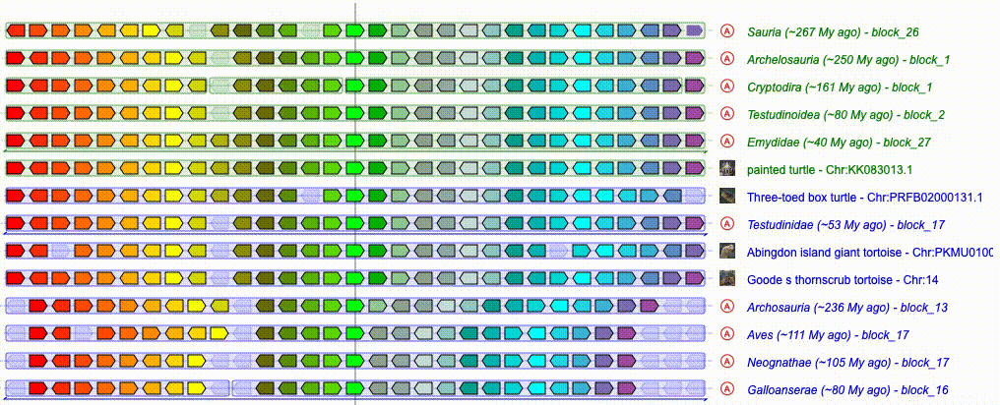

# Automated Search for Hidden Genes in Vertebrate Genomes

This project provides an automated approach for searching for hidden genes in vertebrate genomes. The method is based on syntenic information and can be used to identify novel genetic factors involved in various biological processes. The code in this repository was developed as part of a diploma thesis project and can be used to identify hidden genes in large and complex genomes, such as those of birds and reptiles. With this automated approach, gene discovery can be accelerated and new insights can be gained into the genetic basis of complex traits and diseases in vertebrates.


*The gif shows an example of a hidden gene DUSP15 (red) in Abingdon island giant tortoise genome. Created with [Genomicus](https://www.genomicus.bio.ens.psl.eu).*

## Installation

Clone this repository. Create a virtual environment using the command ```python3 -m venv env```. Activate the environment source ```env/bin/activate```.
Install the packages using the requirements.txt file ```pip install -r requirements.txt```.
After that, you need to add the virtual environment to Jupyter Notebook.
First, install ipykernel ```pip install --user ipykernel```, then add the virtual environment to Jupyter with ```python3 -m ipykernel install --user --name=env```.

Other dependencies that need to be installed separately are:
- [BLAST](https://www.ncbi.nlm.nih.gov/books/NBK569861/)
- [gtf2bed from BEDOPS](https://bedops.readthedocs.io/en/latest/content/installation.html#installation)

Please follow their documentation for the installation instructions.

## Usage


*Workflow diagram. Created with [Biorender](https://www.biorender.com).*

The source code consists of five jupyter notebooks:
- ```00_pre-download_frequently_used_genomes.ipynb```
- ```01_identify_hidden_genes.ipynb```
- ```02_gene_search.ipynb```
- ```03_found_gene_analysis.ipynb```
- ```04_visualize_found_genes.ipynb```

The input is a table containing orthology information with columns as species and rows as orthology groups. The individual values are Ensembl IDs or orthologs present in that species genome, empty cells represent a missing gene. Such table is the input to ```00``` and ```01```.
The notebook ```01_identify_hidden_genes.ipynb``` wil output a JSON file with hidden genes that are the input to ```02```.
The notebook ```02_gene_search.ipynb``` will output a table containing information about found hidden genes.
After inputting this result table to  ```03``` and ```04```, you can obtain some statistics about the genomic region where the hidden gene was located (GC%, N%) and also a visualization of that area.

## Credits
This work was supported by ELIXIR CZ Research Infrastructure (ID LM2023055, MEYS CR).

## Contact
If you have any questions, feedback or issues regarding the automated approach for searching hidden genes in vertebrate genomes or the code in this repository, please don't hesitate to get in touch:

[Kateřina Večerková](https://www.linkedin.com/in/kateřina-večerková-b62487232/)
vecerkok@vscht.cz / katerina.vecerkova@img.cas.cz

We are always happy to hear from fellow researchers and developers who are interested in this field and welcome any suggestions or contributions to improve the code.